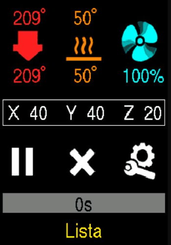

<h1 align="center">Marlin Kingroon KP3S   Pantalla Vertical </h1>

### Marlin 2.0.9.7 [Web Oficial](https://github.com/MarlinFirmware/Marlin)

Sé ha modificado para adaptar los iconos y formato de Marlin a la pantalla vertical de la Kingroon KP3S.

No se han comprobado todas las pantallas/opciones que dispone Marlin, si se modifican los ficheros de configuración Configuration.h y Configuracion_adv.h no se asegura que se visualice correctamente.
- M955 --> Calibrar pantalla táctil, en caso de que no coinciden los toques con la orientación (utilizar algún utensilio fino como un palillo para tocar las indicaciones en pantalla).

Verificado que funciona correctamente con [OctoPrint](https://octoprint.org/)

